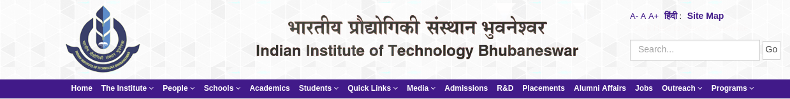
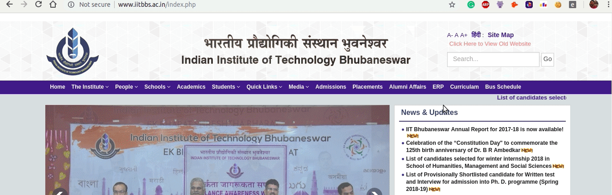

# eziitbbs

> Browser extension that simplifies the IIT Bhubaneswar's website interface and make in easily navigable.

This extension inserts useful links(ERP, Curriculam, Transportation Schedule) in Navigation Bar of website and remove the unncessary links present on the Navigation Bar. More features coming soon!

---

## Install

The Extension can be easily installed from Chrome Web Store. Visit https://chrome.google.com/webstore/detail/eziitbbs/cnpnjhjebdegnailedbagikccciphohk to install the extension on Google Chrome.

**OR**

You can directly install the extension from source code by enabling developer mode in your browser.

- Download the source code by [clicking here](https://github.com/apsknight/eziitbbs/archive/1.0.0.zip)
- Extract the source code ZIP.
- Open a new tab in Google Chrome and open this link: `chrome://extensions`
- Enable `developer mode` option present on top-right corner.
- Click `Load unpacked` button and navigate to `eziitbbs-VERSION_NUM/source`(The directory extracted from previous steps).
- Open IITBBS website and test extension. 

<table>
<tr>
<b>Without extension:</b>

</tr>

<tr>
<b>With extension:</b>

</tr>

## Contribute

See the [contribution guide](contributing.md) and join the [contributors](https://github.com/apsknight/eziitbbs/graphs/contributors)!

## Maintainer
- Aman Pratap Singh

## License

[MIT](https://aps.mit-license.org)
